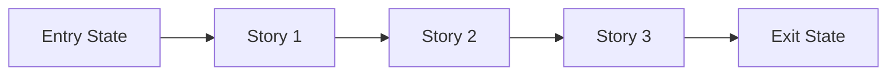

# Phase Contract: Phase <N> - <Phase Name>

Save to `history/<feature>/contracts/phase-<n>-contract.md`.

**Date**: <YYYY-MM-DD>
**Feature**: <feature-slug>
**Phase Plan Reference**: `history/<feature>/phase-plan.md`
**Based on**:
- `history/<feature>/CONTEXT.md`
- `history/<feature>/discovery.md`
- `history/<feature>/approach.md`

---

## 1. What This Phase Changes

> Explain the phase in practical terms first. Someone should be able to picture what is different after this lands.

`<2-4 sentences describing the real-world/system change this phase delivers.>`

---

## 2. Why This Phase Exists Now

- `<why this phase is first or why it follows the previous one>`
- `<what would be blocked or riskier if this phase were skipped>`

---

## 3. Entry State

> What is true before this phase starts?

- `<observable truth 1>`
- `<observable truth 2>`
- `<constraint or dependency already satisfied>`

---

## 4. Exit State

> What must be true when this phase is complete?

- `<observable truth 1>`
- `<observable truth 2>`
- `<integration or system-level truth>`

**Rule:** every exit-state line must be testable or demonstrable.

---

## 5. Demo Walkthrough

> The simplest walkthrough that proves this phase is real.

`<In one short paragraph: "A user can now..." or "The system can now...">`

### Demo Checklist

- [ ] `<step 1>`
- [ ] `<step 2>`
- [ ] `<step 3>`

---

## 6. Story Sequence At A Glance

> Stories explain why the internal order of this phase makes sense before beads are created.

| Story | What Happens | Why Now | Unlocks Next | Done Looks Like |
|-------|--------------|---------|--------------|-----------------|
| Story 1: `<name>` | `<practical outcome>` | `<why first>` | `<what it unlocks>` | `<observable done>` |
| Story 2: `<name>` | `<practical outcome>` | `<why next>` | `<what it unlocks>` | `<observable done>` |
| Story 3: `<name>` | `<practical outcome>` | `<why last>` | `<what it unlocks>` | `<observable done>` |

---

## 7. Technical Contract Details

> This section is mandatory. Do not leave technical details implied.

### 7.1 API Contract

- Endpoint(s): `<method + path>`
- Request shape: `<fields, required/optional, validation>`
- Response shape: `<status codes + payload schema>`

### 7.2 Data / DB / Config Contract

- Source of truth: `<DB table/field or settings key/path>`
- Read/write behavior: `<where the value is loaded/stored>`
- Hardcode policy: `<what must NOT be hardcoded in code>`
- Fallback behavior: `<allowed fallback or explicit fail behavior>`

### 7.3 Bootstrap / Provisioning Contract

- Runtime-critical key/table/value: `<exact settings key/table/field that must exist before runtime>`
- Provisioning mode: `<existing provisioning proof OR idempotent repo-native migration/provisioning artifact>`
- Migration path rule: `<if migration is required, use the migration/provisioning path mandated by active repo/project instructions; do not assume Alembic or a fixed subdirectory>`
- Invariant: `<missing-config fail/500 is corruption guard only, not a substitute for bootstrap>`
- Verification requirement: `<after provisioning, API endpoint returns expected 200/payload>`

### 7.4 Validation + Error Contract

- Invalid input behavior: `<4xx rule + error payload shape>`
- Business-rule failure behavior: `<how rejection is surfaced>`
- Cross-layer impact: `<BE->FE behavior contract when errors occur>`

### 7.5 Observability / Testability Contract

- Evidence split: `<BE/API bead owns curl/HTTP proof; FE/UI bead owns agent-browser before/after screenshots + interpretation + browser-observed network cue; combined bead requires Single-session exception>`
- Required FE E2E proof: `<agent-browser action sequence, before-action screenshot path, after/final screenshot path, what each screenshot proves, expected/observed UI state, or N/A with reason; when required, reference .claude/lessons/browser-runbook.md>`
- Required BE API-call proof: `<curl/http call + expected status/response or N/A with reason>`
- Integration proof: `<how FE action maps to BE side-effect/response; include browser-observed method + path + status and network artifact/requests log path when in scope>`
- Quality gate classification: `<typecheck/lint/build pass or known/pre-existing failure classification>`
- Browser runbook delta: `<unchanged | durable login/navigation/selector/network/UI discovery to append to .claude/lessons/browser-runbook.md>`

---

## 8. Phase Diagram

If the phase has fewer than 3 stories, remove the unused nodes and keep the diagram aligned to the actual sequence.

---

## 9. Out Of Scope

- `<thing intentionally not solved in this phase>`
- `<adjacent idea deferred to a later phase>`

---

## 10. Success Signals

- `<how we know this phase genuinely worked>`
- `<what reviewers or UAT should specifically confirm>`

---

## 11. Failure / Pivot Signals

> If any of these happen, do not blindly continue to later phases.

- `<signal that means the phase design is wrong>`
- `<signal that means the current approach should pivot>`
- `<signal that means the next phase should be reconsidered>`
