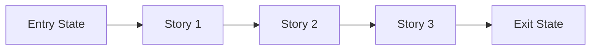
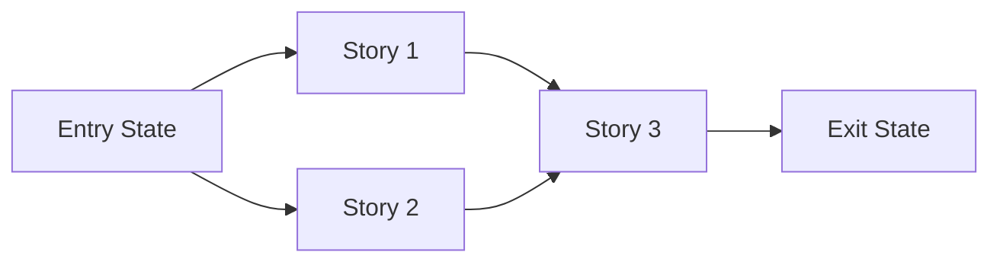

# Story Map: Phase <N> - <Phase Name>

Save to `history/<feature>/story-maps/phase-<n>-story-map.md`.

**Date**: <YYYY-MM-DD>
**Phase Plan**: `history/<feature>/phase-plan.md`
**Phase Contract**: `history/<feature>/contracts/phase-<n>-contract.md`
**Approach Reference**: `history/<feature>/approach.md`

---

## 1. Story Dependency Diagram

Replace the placeholder story nodes with the actual story names. If multiple stories can run in parallel, show that explicitly:

---

## 2. Story Table

| Story | What Happens In This Story | Why Now | Contributes To | Creates | Unlocks | Done Looks Like |
|-------|-----------------------------|---------|----------------|---------|---------|-----------------|
| Story 1: `<name>` | `<practical outcome>` | `<why first>` | `<phase exit-state item>` | `<artifact or capability>` | `<next story>` | `<observable proof>` |
| Story 2: `<name>` | `<practical outcome>` | `<why next>` | `<phase exit-state item>` | `<artifact or capability>` | `<next story>` | `<observable proof>` |
| Story 3: `<name>` | `<practical outcome>` | `<why last>` | `<phase exit-state item>` | `<artifact or capability>` | `<what comes after phase>` | `<observable proof>` |

---

## 3. Story Details

### Story 1: <Name>

- **What Happens In This Story**: `<what becomes true after this story>`
- **Why Now**: `<why it belongs before the next story>`
- **Contributes To**: `<which exit-state statement this story advances>`
- **Creates**: `<code, contract, data, capability>`
- **Unlocks**: `<what later stories can now do>`
- **Done Looks Like**: `<observable finish line>`
- **Candidate Bead Themes**:
  - `BE/API: <backend contract/runtime work + curl/HTTP proof>`
  - `FE/UI: <frontend behavior + agent-browser before/after screenshot proof + screenshot interpretation + browser network cue/artifact + quality-gate classification + .claude/lessons/browser-runbook.md reference/runbook delta>`

### Story 2: <Name>

- **What Happens In This Story**: `<what becomes true after this story>`
- **Why Now**: `<why it belongs here>`
- **Contributes To**: `<which exit-state statement this story advances>`
- **Creates**: `<code, contract, data, capability>`
- **Unlocks**: `<what later stories can now do>`
- **Done Looks Like**: `<observable finish line>`
- **Candidate Bead Themes**:
  - `BE/API: <backend contract/runtime work + curl/HTTP proof>`
  - `FE/UI: <frontend behavior + agent-browser before/after screenshot proof + screenshot interpretation + browser network cue/artifact + quality-gate classification + .claude/lessons/browser-runbook.md reference/runbook delta>`

### Story 3: <Name>

- **What Happens In This Story**: `<what becomes true after this story>`
- **Why Now**: `<why it closes the phase>`
- **Contributes To**: `<which exit-state statement this story advances>`
- **Creates**: `<code, contract, data, capability>`
- **Unlocks**: `<next phase or larger plan>`
- **Done Looks Like**: `<observable finish line>`
- **Candidate Bead Themes**:
  - `BE/API: <backend contract/runtime work + curl/HTTP proof>`
  - `FE/UI: <frontend behavior + agent-browser before/after screenshot proof + screenshot interpretation + browser network cue/artifact + quality-gate classification + .claude/lessons/browser-runbook.md reference/runbook delta>`

Remove any unused story sections and keep only the stories the phase actually needs.

---

## 4. Story Order Check

> If a human reads only this file, the first question they should not need to ask is "why is Story 1 first?"

- [ ] Story 1 is obviously first
- [ ] Every dependency edge is a real prerequisite; independent stories are shown as parallel branches, not forced into a chain
- [ ] If every story reaches "Done Looks Like", the phase exit state should be true

If any box is unchecked, revise the map before creating beads.

---

## 5. Story-To-Bead Mapping

> Fill this in after bead creation so validating and swarming can see how the narrative maps to executable work. Use the exact canonical issue IDs returned by `br create` / `br list --json` (for this repo, `one_hammer-*`), not short aliases such as `br-*`.

| Story | Beads | Notes |
|-------|-------|-------|
| Story 1: `<name>` | `<actual-beads-id>, <actual-beads-id>` | `<shared context or dependency note>` |
| Story 2: `<name>` | `<actual-beads-id>, <actual-beads-id>` | `<shared context or dependency note>` |
| Story 3: `<name>` | `<actual-beads-id>, <actual-beads-id>` | `<shared context or dependency note>` |
