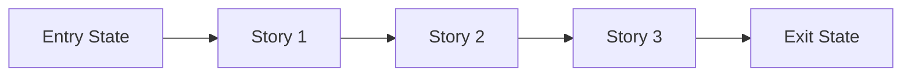
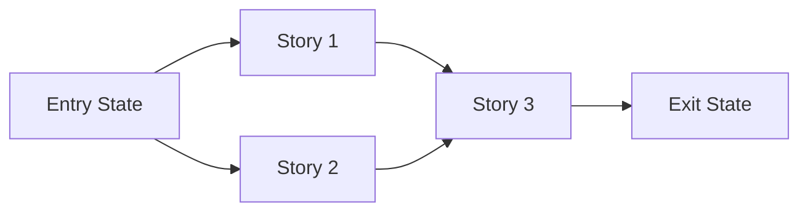

# Story Map: Phase <N> - <Phase Name>

Save to `.planning/history/<feature>/story-maps/phase-<n>-story-map.md`.

**Date**: <YYYY-MM-DD>
**Phase Plan**: `.planning/history/<feature>/phase-plan.md`
**Phase Contract**: `.planning/history/<feature>/contracts/phase-<n>-contract.md`
**Approach Reference**: `.planning/history/<feature>/approach.md`

---

## 1. Story Dependency Diagram



Replace the placeholder story nodes with the actual story names. If multiple stories can run in parallel, show that explicitly:



---

## 2. Story Table

| Story | What Happens In This Story | Why Now | Contributes To | Creates | Unlocks | Done Looks Like |
|-------|-----------------------------|---------|----------------|---------|---------|-----------------|
| Story 1: `<name>` | `<practical outcome>` | `<why first>` | `<phase exit-state item>` | `<artifact or capability>` | `<next story>` | `<observable proof>` |
| Story 2: `<name>` | `<practical outcome>` | `<why next>` | `<phase exit-state item>` | `<artifact or capability>` | `<next story>` | `<observable proof>` |
| Story 3: `<name>` | `<practical outcome>` | `<why last>` | `<phase exit-state item>` | `<artifact or capability>` | `<what comes after phase>` | `<observable proof>` |

---

## 3. Story Details

### Story 1: <Name>

- **What Happens In This Story**: `<what becomes true after this story>`
- **Why Now**: `<why it belongs before the next story>`
- **Contributes To**: `<which exit-state statement this story advances>`
- **Creates**: `<code, contract, data, capability>`
- **Unlocks**: `<what later stories can now do>`
- **Done Looks Like**: `<observable finish line>`
- **Candidate Bead Themes**:
  - `BE/API: <backend contract/runtime work + curl/HTTP proof>`
  - `FE/UI: <frontend behavior + agent-browser before/after screenshot proof + screenshot interpretation + browser network cue/artifact + quality-gate classification + .claude/lessons/browser-runbook.md reference/runbook delta>`

### Story 2: <Name>

- **What Happens In This Story**: `<what becomes true after this story>`
- **Why Now**: `<why it belongs here>`
- **Contributes To**: `<which exit-state statement this story advances>`
- **Creates**: `<code, contract, data, capability>`
- **Unlocks**: `<what later stories can now do>`
- **Done Looks Like**: `<observable finish line>`
- **Candidate Bead Themes**:
  - `BE/API: <backend contract/runtime work + curl/HTTP proof>`
  - `FE/UI: <frontend behavior + agent-browser before/after screenshot proof + screenshot interpretation + browser network cue/artifact + quality-gate classification + .claude/lessons/browser-runbook.md reference/runbook delta>`

### Story 3: <Name>

- **What Happens In This Story**: `<what becomes true after this story>`
- **Why Now**: `<why it closes the phase>`
- **Contributes To**: `<which exit-state statement this story advances>`
- **Creates**: `<code, contract, data, capability>`
- **Unlocks**: `<next phase or larger plan>`
- **Done Looks Like**: `<observable finish line>`
- **Candidate Bead Themes**:
  - `BE/API: <backend contract/runtime work + curl/HTTP proof>`
  - `FE/UI: <frontend behavior + agent-browser before/after screenshot proof + screenshot interpretation + browser network cue/artifact + quality-gate classification + .claude/lessons/browser-runbook.md reference/runbook delta>`

Remove any unused story sections and keep only the stories the phase actually needs.

---

## 4. Story Order Check

> If a human reads only this file, the first question they should not need to ask is "why is Story 1 first?"

- [ ] Story 1 is obviously first
- [ ] Every dependency edge is a real prerequisite; independent stories are shown as parallel branches, not forced into a chain
- [ ] If every story reaches "Done Looks Like", the phase exit state should be true

If any box is unchecked, revise the map before creating beads.

---

## 5. Story-To-Bead Mapping

> Write `<bead:KEY>` tokens here (matching the `key` values in the Bead Specs block below). Do NOT invent issue IDs by hand: `materialize_beads.mjs` replaces every `<bead:KEY>` token with the exact canonical issue ID returned by `br create` when Phase 5 runs. Never write short aliases such as `br-*`.

| Story | Beads | Notes |
|-------|-------|-------|
| Story 1: `<name>` | `<bead:p1-s1-be>` | `<shared context or dependency note>` |
| Story 2: `<name>` | `<bead:p1-s2-be>` | `<shared context or dependency note>` |
| Story 3: `<name>` | `<bead:p1-s3-be>, <bead:p1-s3-fe>` | `<shared context or dependency note>` |

---

## 6. Bead Specs (machine-readable)

> This block is the deterministic input for `node .claude/hooks/planning/materialize_beads.mjs --feature <feature>`. The script — not the LLM — runs `br create` and `br dep add` from it, so what the reviewer approves in Phase 4 is exactly what materializes in Phase 5.
>
> Rules:
> - `key` is globally unique across ALL phase story-maps of the feature (convention: `p<phase>-s<story>-<surface>`, e.g. `p1-s1-be`, `p3-s1-fe`).
> - `depends_on` lists other spec keys (cross-phase allowed) or, rarely, an existing canonical issue ID. Only real prerequisites — keep independent beads parallel-ready (fan-out/fan-in, not a forced chain).
> - `description` must be complete for a fresh worker and must carry every mandatory clause from SKILL.md Phase 5 (technical contract, surface-matching BE/FE verification clauses, migration/provisioning decision, completion evidence gate, test session budget). The script validates these clauses with the same rules the hook applies and refuses to create beads when one is missing.
> - `labels` must include the feature slug, `phase-<n>`, and the surface (`be`/`fe`/`test`/`docs`).

```json bead-specs
{
  "beads": [
    {
      "key": "p1-s1-be",
      "story": "Story 1: <name>",
      "title": "[<feature>][P1.S1] <title>",
      "type": "task",
      "priority": 1,
      "labels": ["<feature>", "phase-1", "be"],
      "depends_on": [],
      "description": "<full clause-bearing description: context for a fresh worker + Technical Contract (API/DB/config source-of-truth) + BE verification clause (curl/API + auth/token + expected status/response) + migration/provisioning decision clause + Completion Evidence Gate (no br close until evidence recorded) + Test Session Budget: <=1 session>"
    },
    {
      "key": "p1-s2-be",
      "story": "Story 2: <name>",
      "title": "[<feature>][P1.S2] <title>",
      "type": "task",
      "priority": 1,
      "labels": ["<feature>", "phase-1", "be"],
      "depends_on": ["p1-s1-be"],
      "description": "<...>"
    }
  ]
}
```
